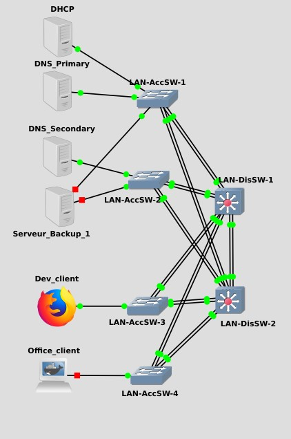

# Complete-Network-Simulation

---

Complete simulation of an IT System with GNS3 and Docker at the hardware (switch, router, firewall), protocol (DHCP, DNS, NTP, ...) and service (Web Server, Proxy, Backup and Monitoring) level.

## Table of contents

---

- [Objective](#obj)
- [Description](#desc)
- [Choice](#choice)
- [How to use](#use)
- [Project Progress](#progress)
- [Configuration Explained](#config)
	- [LAN](#LAN)
	- [DMZ](#DMZ)
	- [IT Administration](#admin)
- [Test](#test)
- [License](#license)

##  Objective

---

The objective of this project is to use the sum of my current knowledge in the areas of Network, System and Security in order to better understand the interactions between the different components of an IT System. And in the process, keep learning !!!

##  Description

----

The topology is composed of three zones : LAN, DMZ and IT administration. The focus is on redundancy and security (hardware and software). 

The LAN is a 2-Tier architecture (Access and Distribution Switch) corresponding to that of a small business located in a single building.

The DMZ will have a proxy used as web filter, two web servers (with a reverse proxy for security reasons and to provide load-balancing).
 
The IT administration is the central point of system supervision (and allow another backup server for safety reason).

A series of tests will be carried out to show how the simulation works.

##  Choice

---

The hardware will come from differents manufacters : Cisco, Juniper, Pfsense (firewall computer software), ... This choice is dicated by the non-availability of all the different components free of charge on the GNS3 marketplace. It can be seen as a blessing in disguise as it allows me to confront different types of configuration and it is increasing the Network Security by preventing a vulnerability from impacting all the hardware components.

The OS will be based on Linux distros : Debian and AlmaLinux (RHEL fork) as they offer more possibilities for optimization : important in the context of security and energy consumption. However, in the future, I will certainly make a fork of this project with Windows for the PC and an Active Directory, to be closer to the usual configuration of an IT System in a company.

The firewall's number (redundancy and DMZ enclosed) can be considered too expensive for the budget of a small business but it is for learning purpose.

  

##  How to use

---

The download of GNS3 is available on the [GNS3 Site](www.gns3.com/software/download).

The appliances used in this project are :

- 

The Docker support in GNS3 is explained [here](doc.gns3.com/docs/emulators/docker-support-in-gns3).

The Docker images used for this project are in the [another repo].

And finaly, the GNS3 file generated by the project is available in this [location](project.gns3)

##  Project Progress

---

The next step will the implementation of : Firewall

##  Configuration Explained

---

###  LAN

#### <ins>Hardware</ins>

- [Access Switch 1](LAN/AccSW-1.md)
- [Access Switch 2](LAN/AccSW-2.md)
- [Access Switch 3](LAN/AccSW-3.md)
- [Access Switch 4](LAN/AccSW-4.md)
- [Distribution Switch 1](LAN/DisSW-1.md)
- [Distribution Switch 2](LAN/DisSW-2.md)

#### <ins>Server Configuration</ins>

- [DHCP Server](LAN/DHCP_Server.md)
- [Primary DNS Server](LAN/DNS_Server_Primary.md)
- [Secondary DNS Server](LAN/DNS_Server_Secondary.md)

###  DMZ

###  IT Administration

##  Test 

---

##  License

---

This project is under GNU General License v3.0 or later, see [License](license.md).

