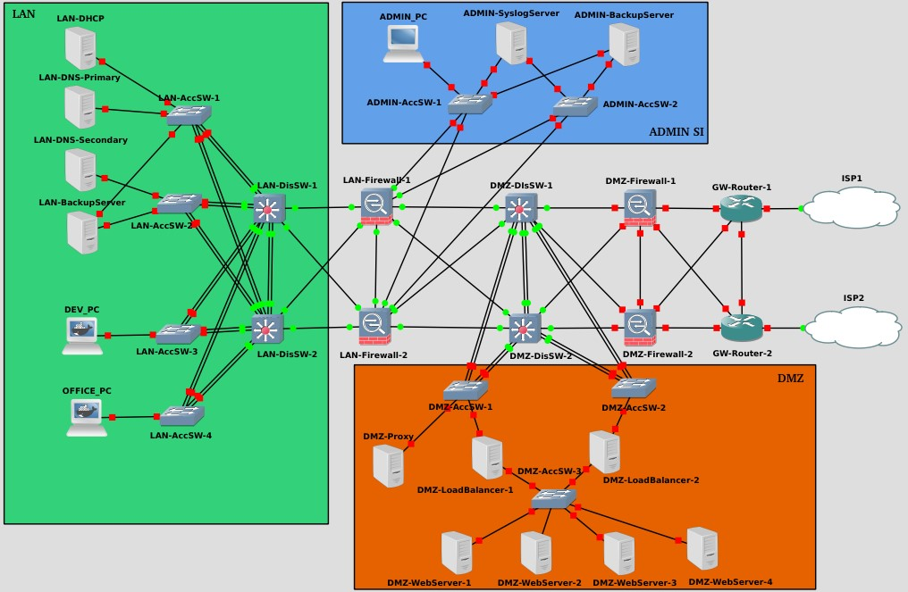
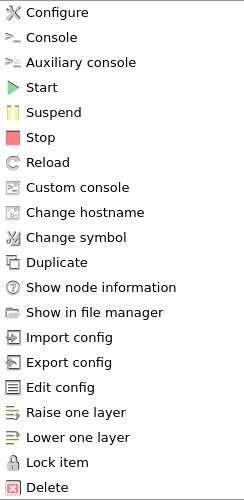

# Complete-Network-Simulation

---

Complete simulation of an IT System using GNS3 and Docker at the hardware (switch, router, firewall), protocol (DHCP, DNS, NTP, ...) and service (Web Server, Proxy, Load Balancer, Backup and Monitoring) level.

## Table of contents

---

- [Objective](#obj)
- [Description](#desc)
	- [LAN](#LAN)
	- [DMZ](#DMZ)
	- [IT Administration](#admin)
	- [Network](#network)
- [How to use](#use)
- [Tips and tricks](#tips)
	- [MAC Address troubleshooting](#mac)
	- [Saving your Docker configuration files in GNS3](#docker)
- [Test](#test)
- [License](#license)

##  Objective

---

The objective of this project is to use the sum of my current knowledge in the areas of Network, System and Security in order to better understand the interactions between the different components of an IT System. And in the process, keep learning !!!

##  Description

----

The topology is composed of three zones : LAN, DMZ and IT administration. The focus is on redundancy and security (hardware and software). 

###  LAN

The LAN is a 2-Tier architecture (Access and Distribution Switch) corresponding to that of a small business located in a single building. 
The network is divided in 4 VLANs : Service (DHCP, DNS, NTP), Backup (first backup solution), Dev (for developers) and Office (for all other staff). The choice of VLANs was established according to the use cases defined at the base of the project.

Two protocols have been configured : 
- Per-VLAN Spanning Tree Plus (PVST+) distributed equally between the two Distribution Switch to ensure the use of all LAN network cables.
- Hot Standby Router Protocol (HSRP) to ensure redundancy.

#### <ins>Hardware</ins>

- [Access Switch 1](LAN/AccSW-1.md)
- [Access Switch 2](LAN/AccSW-2.md)
- [Access Switch 3](LAN/AccSW-3.md)
- [Access Switch 4](LAN/AccSW-4.md)
- [Distribution Switch 1](LAN/DisSW-1.md)
- [Distribution Switch 2](LAN/DisSW-2.md)

#### <ins>Server Configuration</ins>

- [DHCP Server](LAN/DHCP_Server.md)
- [Primary DNS Server](LAN/DNS_Server_Primary.md)
- [Secondary DNS Server](LAN/DNS_Server_Secondary.md)

###  DMZ

The DMZ has a proxy used as web filter : all the trafic between the VLANs of staff members (Dev and Office) and the Internet pass trough this proxy.

- [Forward Proxy](DMZ/DMZ-Proxy.md)

The various web services (applications, website) will be made available to our customers through 4 web servers. 
The traffic to the different services will be distributed by two Nginx load balancers. 
These will be grouped together in the form of a high availability cluster using Pacemaker and Corosync.

- [Load Balancer Cluster](DMZ/DMZ-LoadBalancer.md)

- Webservers

###  IT Administration

The IT administration is the central point of system supervision (and allow another backup server for safety reason). 

###  Network

The distribution of routing information is ensured by the OSPF protocol.

##  How to use

---

The download of GNS3 is available on the [GNS3 Site](www.gns3.com/software/download).

The appliances used in this project are :

- Router : Cisco c7200 series
- Switch : 
- Firewall :

The Dockerfiles needed to create the images used by this project are available in this [folder](/Dockerfiles/).

The Docker support in GNS3 is explained [here](doc.gns3.com/docs/emulators/docker-support-in-gns3).

And finaly, the GNS3 file generated by the project is available in this [location](project.gns3)

##  Tips and tricks

---
###  MAC ADDRESS TROUBLESHOOTING

Docker containers created from the same image can sometimes have the same MAC address on an interface.

This is the first to be checked during a communication problem at the level of the data link layer.

The Docker images used for this project have the iproute2 command. It is therefore this one that will be used to make the change of MAC address on an interface. 

First, turn off the network card using command :

	ip link set dev eth0 down

Next, set the new MAC address using command :

	ip link set dev eth0 address xx:xx:xx:xx:xx:xx

Finally, turn on the network card using command :

	ip link set dev eth0 up

###  SAVING YOUR DOCKER CONFIGURATION FILES IN GNS3

By default, you will loose all your files after a restart of the Docker Container. As GNS3 takes care of the run, it will be using its options that we will create the persistent volumes.

Right-click on your Docker container in GNS3. Choose "Configure", then the "Advanced" tab.

Add the following lines in "Addition directories to make persistent that are not included in the images VOLUME config. One directory per line" :

/bin
/boot
/dev
/etc
/gns3
/gns3Volumes
/home
/lib
/lib64
/root
/sbin
/var
/usr

As a bonus, it will allowed you to access the different Docker files by using "Show in file manager". 
It can be helpful to copy-paste between the Docker (inside your GNS3 VM) and a text editor on your Host.

##  Test 

---

##  License

---

This project is under GNU General License v3.0 or later, see [License](license.md).

